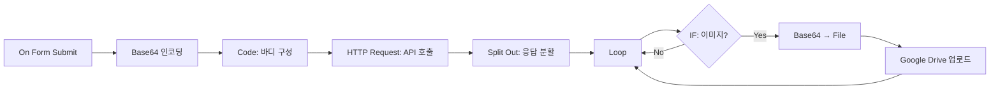
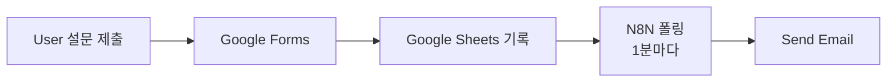
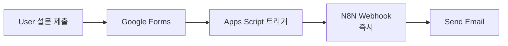
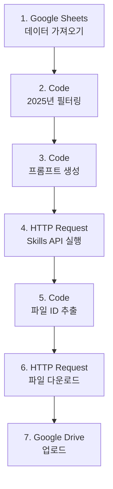
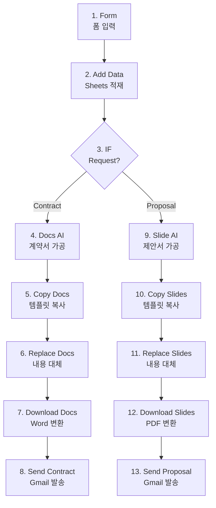
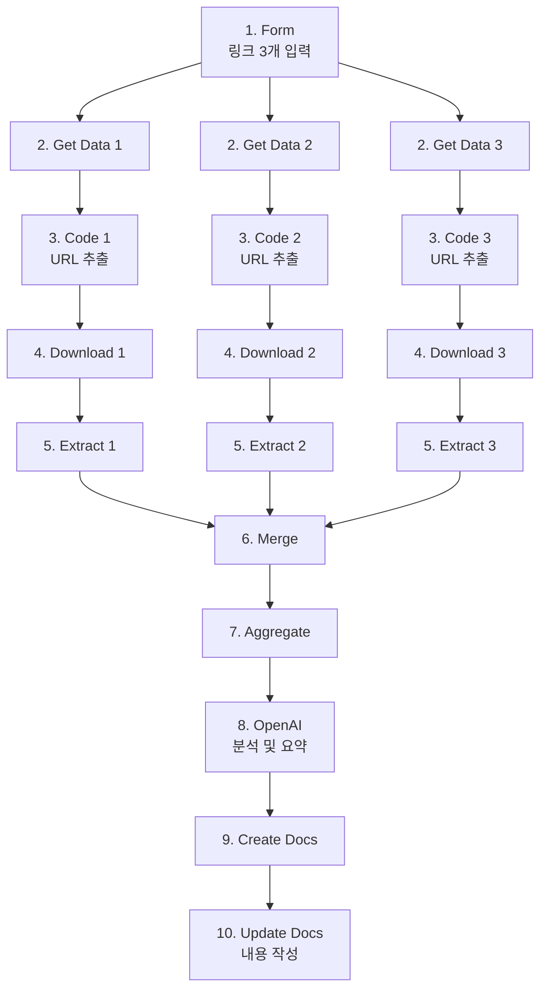

# N8N 작업 참조 가이드

> **목적**: 앞으로의 N8N 워크플로우 작업을 위한 핵심 정보 모음

---

## 📋 목차

1. [YouTube API 사용법](#youtube-api-사용법)
2. [채널 ID 찾는 방법](#채널-id-찾는-방법)
3. [OpenAI 노드 구조](#openai-노드-구조)
4. [자막 처리 문제](#자막-처리-문제)
5. [검증된 워크플로우](#검증된-워크플로우)
6. [문제 해결 패턴](#문제-해결-패턴)

---

## 🎥 YouTube API 사용법

### API Key 방식 (읽기 전용)

**노드 타입**: HTTP Request

**영상 검색 (❌ 작동 안 함)**:
```
URL: https://www.googleapis.com/youtube/v3/search
Parameters:
  - part: snippet
  - channelId: {{ $json.id }}
  - order: date
  - type: video
  - maxResults: 10
  - key: YOUR_API_KEY
```

**이유**: YouTube가 search 엔드포인트를 제한함

---

### PlaylistItems 방식 (✅ 권장)

**업로드 재생목록 사용**:

```
URL: https://www.googleapis.com/youtube/v3/playlistItems
Parameters:
  - part: snippet
  - playlistId: {{ 'UU' + $json.id.substring(2) }}
  - maxResults: 10
  - key: YOUR_API_KEY
```

**핵심**: 채널 ID의 `UC...` → `UU...`로 변경하면 업로드 재생목록!

**예시**:
- 채널 ID: `UChlv4GSd7OQl3js-jkLOnFA`
- 재생목록: `UUhlv4GSd7OQl3js-jkLOnFA`

---

### 통계 조회

```
URL: https://www.googleapis.com/youtube/v3/videos
Parameters:
  - part: statistics,snippet
  - id: {{ $json.items.map(item => item.snippet.resourceId.videoId).join(',') }}
  - key: YOUR_API_KEY
```

**주의**: PlaylistItems는 `item.snippet.resourceId.videoId` 경로!

---

## 🔍 채널 ID 찾는 방법

### 방법 1: URL에서 직접

채널 페이지가 다음 형식이면:
```
youtube.com/channel/UChlv4GSd7OQl3js-jkLOnFA
                    ↑ 이게 채널 ID
```

### 방법 2: 페이지 소스 보기

1. 채널 페이지에서 **우클릭** → **페이지 소스 보기**
2. `Ctrl + F` → **"channelId"** 검색
3. `"channelId":"UC..."` 복사

### 방법 3: 채널 공유 기능

1. 채널 설명에서 **더 보기** 클릭
2. **채널 공유** 버튼
3. **채널 아이디 복사** 클릭

---

## 🤖 OpenAI 노드 구조

### 최신 구조 (LangChain 기반)

**노드 타입**: `@n8n/n8n-nodes-langchain.openAi`  
**TypeVersion**: `2`

```json
{
  "type": "@n8n/n8n-nodes-langchain.openAi",
  "typeVersion": 2,
  "parameters": {
    "modelId": {
      "__rl": true,
      "mode": "list",
      "value": "gpt-4o-mini"
    },
    "responses": {
      "values": [
        {
          "role": "system",
          "content": "시스템 프롬프트..."
        },
        {
          "role": "user",
          "content": "={{ '동적 내용: ' + $json.field }}"
        }
      ]
    },
    "options": {
      "responseFormat": "json_object"
    }
  }
}
```

### 구 버전 (❌ 사용 금지)

```json
{
  "type": "n8n-nodes-base.openAi",
  "parameters": {
    "resource": "chat",
    "model": "gpt-4o",
    "prompt": { ... }
  }
}
```

**이유**: N8N 업데이트로 더 이상 지원 안 함

---

## 🎭 자막 처리 문제

### YouTube Transcript API 상태

**❌ 모두 작동 안 함**:
- `https://youtube.com/api/timedtext?v=...&lang=ko`
- `https://youtube.com/api/timedtext?v=...&lang=ko&fmt=json3`
- `https://youtube.com/api/timedtext?v=...&type=track&lang=ko`

**이유**: YouTube의 봇 방지 정책 강화

---

### 대안 1: Whisper API (추천)

**비용**: $0.006/분 (60초 = $0.006)

**워크플로우**:
1. yt-dlp로 오디오 추출
2. OpenAI Whisper API 호출
3. 텍스트 변환

**문제**: yt-dlp 설치 필요

---

### 대안 2: 메타데이터만 사용 (✅ 현재 채택)

**사용 가능한 정보**:
- ✅ 제목 (가장 중요!)
- ✅ 조회수
- ✅ 좋아요/댓글 수
- ✅ 설명(description)

**장점**:
- 즉시 작동
- 기술적 장애 없음
- 충분한 품질

---

## 📦 검증된 워크플로우

### 최종 완성 파일

**[Shorts_Ultimate_NoSubtitle_FINAL.json](file:///c:/Users/user/Desktop/gpt/n8n-copilot/shots/Shorts_Ultimate_NoSubtitle_FINAL.json)**

**노드 구성 (21개)**:
1. Schedule Trigger (6시간마다)
2. 타겟 채널 리스트
3. PlaylistItems로 영상 조회
4. 통계 수집
5. 이상치 감지 (평균 대비 1.5배 이상)
6. TOP 5 선택
7. GPT 트렌드 분석 (제목 기반)
8. 주제 재해석 (보람이 페르소나)
9. 대본 생성 (6문장)
10. 대본 6분할
11. DALL-E 이미지 생성
12. TTS 오디오 생성
13-14. Google Drive 백업
15. 자산 병합
16. Creatomate 렌더링
17. 대기 30초
18. 영상 다운로드
19. 영상 검증
20. YouTube 업로드
21. Google Sheets 로깅

---

### 필수 Placeholder

```json
YOUR_YOUTUBE_API_KEY
YOUR_GOOGLE_SHEET_ID
YOUR_DRIVE_FOLDER_ID
YOUR_CREATOMATE_TEMPLATE_ID
```

**노드 2**에서 채널 ID 설정:
```javascript
const targetChannels = [
  { id: 'UChlv4GSd7OQl3js-jkLOnFA', name: '삼프로TV', avgViews: 50000 }
];
```

**노드 3**에서 playlistId:
```
UUhlv4GSd7OQl3js-jkLOnFA  // UC → UU
```

---

## 🔧 문제 해결 패턴

### 문제 1: Search API 결과 0개

**증상**: `items: []`, `totalResults: 0`

**원인**: YouTube가 search 엔드포인트 제한

**해결**: PlaylistItems 사용

---

### 문제 2: 채널 ID 틀림

**증상**: `totalResults: 0` (channels 조회 시)

**해결**: 페이지 소스에서 정확한 ID 확인

---

### 문제 3: OpenAI 노드 오류

**증상**: "New node version available"

**원인**: 구 버전 노드 구조 사용

**해결**: 
- `type`: `@n8n/n8n-nodes-langchain.openAi`
- `responses.values` 배열 사용

---

### 문제 4: Expression 평가 오류

**증상**: "Invalid value"

**N8N UI에서**:
```
{{ expression }}  // = 없이
```

**JSON 파일에서**:
```json
"value": "={{ expression }}"  // = 있어야 함
```

---

### 문제 5: 자막 추출 실패

**해결**: 자막 없이 제목만 사용 (충분함)

---

## 💰 비용 최적화

### GPT-4o-mini 사용

**절감 효과**: 94% (vs GPT-4o)

| 모델 | 비용/1K tokens | 영상당 |
|------|----------------|--------|
| GPT-4o | $0.0025 | $0.012 |
| **GPT-4o-mini** | $0.00015 | **$0.0007** |

---

### 전체 비용 (영상 1개)

| 항목 | 비용 |
|------|------|
| GPT-4o-mini (3회) | $0.0007 |
| DALL-E 3 (6회) | $0.240 |
| TTS-1-HD (6회) | $0.007 |
| Creatomate | $0.20 |
| **Total** | **$0.448** |

---

## 📚 참조 영상

**N8N + YouTube 모니터링**:
- URL: https://www.youtube.com/watch?v=tVP1F-0zlzE
- 제목: "유튜브 채널 최신 영상 모니터링 워크플로우"
- 내용: N8N과 YouTube Data API v3 연동
- 참고: Search API는 다루지 않음 (PlaylistItems 사용 권장)

---

## 🎯 Best Practices

### 1. API 설계

- ✅ PlaylistItems 사용 (Search 대신)
- ✅ 채널 ID → 재생목록 ID 변환
- ✅ Quota 절약 (2-Stage Filtering)

### 2. 노드 구조

- ✅ LangChain 기반 OpenAI 노드
- ✅ `responses.values` 배열
- ✅ GPT-4o-mini 사용

### 3. 데이터 처리

- ✅ 제목 기반 분석 (자막 불필요)
- ✅ 이상치 감지 (평균 대비 1.5배)
- ✅ TOP 5만 GPT 처리

---

## 🔄 업데이트 이력

- **2025-11-22**: 최초 작성
- Search API → PlaylistItems 전환
- 자막 처리 제거 (제목 기반)
- OpenAI 노드 구조 업데이트

---

---

## 🤖 MCP + N8N 100% 쇼츠 자동화 파이프라인

> **혁명적 변화**: 편집 툴 없이 대화만으로 완전 자동화!

### 📌 기존 방식의 한계

**❌ 수동 작업 필요**:
- 프리미어/캡컷 등 편집 툴 사용
- 수작업 편집 불가피

**❌ 일관성 유지 어려움**:
- 캐릭터 일관성 문제
- 스토리 퀄리티 편차
- 항상 다른 결과물

**❌ 피드백 반영 불가**:
- 마음에 안 들면 처음부터 다시
- 부분 수정 불가능

---

### ✅ MCP 방식의 혁신

**💡 핵심 개념**:
- **Claude = 디렉터 + 편집자**
- **N8N = 제작 파이프라인**
- **MCP = 브릿지 역할**

**🎯 완전 자동화**:
```
"캐릭터 표정을 더 밝게 해 줘"
"의상을 직장인 출근룩으로 해 줘"
```
→ 대화만으로 모든 편집 완료!

---

### 🏗️ 에이전틱 vs 순차적 워크플로우

| 항목 | 순차적 워크플로우 | 에이전틱 워크플로우 |
|------|------------------|---------------------|
| **유연성** | 고정된 순서 | 자유로운 순서 |
| **수정** | 불가능 | 즉시 가능 |
| **피드백** | 불가능 | 대화로 반영 |
| **컨트롤** | N8N | Claude |
| **일관성** | 낮음 | 높음 |

**에이전틱의 장점**:
- ✅ 캐릭터 일관성 자동 관리
- ✅ 스토리 퀄리티 유지
- ✅ 편집 툴 불필요
- ✅ 즉각적 피드백 반영

---

### 📋 MCP 서버 설정

#### 1단계: MCP 서버 트리거 생성

```
N8N에서:
1. "MCP" 검색
2. MCP Server Trigger 노드 추가
3. Production URL 복사
```

#### 2단계: 보안 설정 (Optional)

**Bearer Authentication**:
- 새 Credential 생성
- 랜덤 토큰 생성 (권장)
- Header에 토큰 설정

#### 3단계: 도구 연결

**N8N Workflow Tool 사용**:
```
1. "+ Tool" 클릭
2. "N8N Workflow 2" 선택
3. 서브 워크플로우 선택
4. 파라미터 매핑 (Magic Button)
5. Description 추가 (영문 권장)
```

**디스크립션 작성 팁**:
- ✅ 영문명 사용
- ✅ 인자값 설명 추가
- ✅ 에이전트가 이해하기 쉽게

---

### 🎬 워크플로우 패턴 상세

#### Pattern 1: 스토리 기획

**트리거**: When executed by another workflow

**입력 파라미터**:
```json
{
  "story": "String"
}
```

**AI 에이전트 구성**:
```markdown
### 일반 지침
동물 쇼츠 비디오 30초 동영상을 만듭니다.
귀엽고 재밌는 유머러스한 영상을 기획합니다.

### 세부 지침
- 6개 장면으로 구성
- 각 장면 5초
- 연결된 플롯 유지

### 출력 항목
- AI 이미지 프롬프트 (영어)
- 자막 (12자 이내, 줄바꿈)
- 나레이션 (귀여운 톤)
```

**LangChain 구조**:
- **Chain Model**: GPT-4o-mini / Claude / Gemini
- **Parser**: Structured Output Parser (JSON)
- **Auto Fix Format**: 복잡한 구조일 때만 활성화

**추천 모델**:
- 기획용: Gemini 2.5 Pro (품질)
- 속도용: GPT-4o-mini (빠름)

---

#### Pattern 2: 이미지 생성

**사용 서비스**: Replicate (Flux Dabe 1.1)

**입력 파라미터**:
```json
{
  "prompt": "String (Claude 입력)",
  "aspect_ratio": "9:16 (고정)",
  "model": "flux-dabe-1.1 (고정)",
  "prompt_suffix": "3D animation, Disney Pixar style (고정)"
}
```

**HTTP Request 설정**:
```javascript
// URL
https://api.replicate.com/v1/models/{model}/predictions

// Authentication
Bearer Token (Replicate API Key)

// Headers
Prefer: wait  // 생성 완료까지 대기

// Body
{
  "input": {
    "prompt": "{{ $json.prompt }} {{ $json.suffix }}",
    "aspect_ratio": "{{ $json.aspect_ratio || '1:1' }}"
  }
}
```

**S3 업로드**:
```
Bucket: your-bucket
Path: flux/{{ $json.id }}.webp
Public URL: CloudFront CDN 활용
```

---

#### Pattern 3: 이미지 일관성 유지 (Gemini)

**목적**: 캐릭터는 유지하면서 장면만 변경

**사용 모델**: Gemini 2.0 Flash (Image Generation)

**워크플로우**:
```
1. If 노드: URL 존재 여부 확인
   - True: URL 다운로드
   - False: Binary 직접 사용

2. Code 노드: 데이터 처리
   - URL → Binary 변환

3. Gemini API 요청:
   - Image + Text Prompt
   - "Keep character, change scene"

4. 에러 처리:
   - Continue using error output
   - 실패 시 Claude에 알림
```

**에러 처리 패턴**:
```javascript
// Settings
Continue using error output: true

// 성공 경로 → S3 업로드
// 에러 경로 → Error 노드 → Claude 알림
```

---

#### Pattern 4: 비디오 생성 (분리 패턴)

**문제점**: 비디오 생성은 1-2분 소요, MCP 타임아웃은 32초

**해결책**: 요청/확인 분리

**Step 1: 비디오 생성 요청**
```
API: File AI (Kling 2.1)
Input: Image URL
Output: Generation ID
시간: 5초 이내
```

**Step 2: 상태 확인 (별도 도구)**
```
1. 상태 조회 (GET)
2. If "Complete" → Download
3. Else → Wait 20초 → 재조회
4. 2회 이상 미완료 → "다시 시도" 메시지
```

**강건성 확보**:
- ✅ 30초 이내 응답 보장
- ✅ Claude가 계속 재시도 가능
- ✅ 무한 대기 방지

---

#### Pattern 5: 나레이션 생성

**사용 서비스**: ElevenLabs

**커스텀 노드 설치**:
```
Settings → Custom Nodes
검색: "ElevenLabs n8n Nodes"
설치 후 재시작
```

**노드 설정**:
```json
{
  "voice": "일본 성우 톤 (귀여운)",
  "model": "ElevenLabs Multilingual",
  "language": "ko",
  "stability": 0.5,
  "clarity": 0.75,
  "speed": 1.0
}
```

**출력**: MP3 → S3 업로드

---

#### Pattern 6: 최종 렌더링 (Media FX)

**혁명**: API 서비스 대신 자체 렌더링!

**기존 API 비용**:
- Creatomate: ~$0.20/영상
- JSON Video: ~$0.15/영상

**Media FX (무료)**:
- ✅ 컴퓨터 리소스 활용
- ✅ 무제한 렌더링
- ✅ 모든 효과 지원

**커스텀 노드 설치**:
```
Settings → Custom Nodes
검색: "n8n Nodes Media FX"
설치
```

**주요 기능**:
1. **Video Merge**: 여러 영상 병합 + 전환 효과
2. **Subtitle**: 자막 삽입 (폰트, 색상, 위치)
3. **Audio Mix**: 나레이션 + 배경음악
4. **Convert**: 이미지 → 비디오
5. **Effects**: 페이드, 전환, 자르기

---

### 🎥 렌더링 워크플로우 상세

#### 장면별 처리 (Loop)

```
For each scene (6개):
  1. 비디오 다운로드
  2. 자막 삽입
     - Text: {{ $json.subtitle }}
     - Duration: 1-4초
     - Font: Noto Sans KR
     - Size: 60
     - Color: White
     - Outline: Black
     - Position: Bottom
  
  3. 나레이션 믹스
     - Video Volume: 3
     - Audio Volume: 3
     - Start: 1초
     - Fade In: 0.3초
  
  4. S3 업로드
     - Path: scenes/scene_{{ $index }}.mp4
```

#### 병합 및 전환 (Aggregate)

```
1. Aggregate 노드
   - Field: sceneUrls
   - Mode: Individual Fields
   → 6개 URL 배열 생성

2. Video Merge
   - Transition: Wipe Up
   - Duration: 0.5초
   - Scenes: {{ $json.sceneUrls }}

3. 배경음악 믹스
   - Video Volume: 3
   - Music Volume: 0.5
   - Mode: Shortest
   - Fade Out: 1초

4. 최종 S3 저장
```

---

### 🔗 Claude + MCP 통합

#### Claude Desktop 설정

**1. 통합 추가**:
```
클릭: 검색 및 도구 아이콘
클릭: "통합 추가하기"
```

**2. 연동 정보 입력**:
```
이름: MCP_Generate_Shorts_Video
URL: [N8N Production URL]
인증: Bearer Token (선택)
```

**3. 활성화 확인**:
```
✅ 7가지 도구 활성화 확인
✅ N8N 워크플로우 Active 상태 확인
```

---

#### Claude 프롬프트 작성

```markdown
6개 장면으로 구성된 귀여운 동물 쇼츠 영상을 제작해 주세요.

[필수 지침]
- 무조건 MCP 도구 사용
- 단계별로 진행
- 중간 결과물 출력 (피드백 위해)

[캐릭터 컨셉]
- 동물: 햄스터
- 직업: 판교밸리 K 직장인
- 성격: 성실하지만 가끔 실수

[스토리]
평화로운 오후 사무실에서 코딩하다 버그를 만나 당황하지만
침착하게 극복하는 이야기

[단계]
1. 스토리 기획 (Generate Story)
2. 캐릭터 이미지 생성 (Generate AI Image)
3. 장면별 이미지 생성 (6개)
4. 장면별 비디오 생성 (6개)
5. 비디오 다운로드 확인
6. 나레이션 생성 (6개)
7. 최종 렌더링 (Render Final Video)

[배경 음악]
{{ S3_MUSIC_URL }}

진행 상황을 단계별로 알려주세요!
```

---

### 🎯 피드백 반영 시스템

**즉시 수정 가능**:
```
사용자: "장면 2에서 커피 대신 머리를 쥐어뜯는 장면으로 바꿔줘"

Claude:
1. 장면 2 인식
2. 이미지 재생성 (새 프롬프트)
3. 비디오 재생성
4. 해당 장면만 교체
5. 렌더링 재실행
```

**부분 수정 예시**:
- "캐릭터 표정을 더 밝게"
- "의상을 출근룩으로"
- "배경을 사무실로"
- "음악 볼륨을 줄여줘"

**전체 재생성 없이** 원하는 부분만 수정!

---

### 💰 비용 비교

| 항목 | API 방식 | MCP + Media FX |
|------|----------|----------------|
| 렌더링 | $0.20 | **무료** |
| 수정 비용 | 전체 재생성 | 부분만 |
| 자유도 | 제한적 | **완전 자유** |
| 속도 | API 대기 | **즉시** |

**절감 효과**: 영상당 ~$0.20 절약! 🎉

---

### 📚 필수 리소스

**커스텀 노드**:
1. **ElevenLabs n8n Nodes**: 나레이션
2. **n8n Nodes Media FX**: 렌더링

**API 서비스**:
1. **Replicate**: 이미지 생성 (Flux)
2. **File AI**: 비디오 생성 (Kling)
3. **Gemini**: 이미지 일관성
4. **ElevenLabs**: TTS
5. **AWS S3 + CloudFront**: 파일 저장

**필수 설정**:
- N8N: Self-hosted 또는 Cloud
- Claude Desktop: 최신 버전
- MCP Server: 항상 Active

---

### 🔥 핵심 성공 요소

**1. 도구 디스크립션**:
```
좋은 예:
"Generate AI image from text prompt in English. 
Returns: Image URL"

나쁜 예:
"이미지 생성"
```

**2. 에러 처리**:
```javascript
// 모든 중요 노드에 에러 처리 추가
Settings → On Error → Continue using error output

// Error 노드로 Claude에 알림
"Failed: {{ $json.error }}. Please try again."
```

**3. 타임아웃 관리**:
```
- MCP 타임아웃: 32초
- 긴 작업: 요청/확인 분리
- Wait 노드: 20초 이하
```

**4. Claude 가이드**:
```
- 단계별 지침 명확히
- 중간 결과물 출력 유도
- 항상 MCP 사용 강제
```

---

### 🎬 완성된 시스템

**입력**: "판교밸리 햄스터 이야기 만들어줘"

**자동 실행**:
1. ✅ 스토리 기획 (6장면)
2. ✅ 캐릭터 디자인
3. ✅ 이미지 생성 (6개)
4. ✅ 비디오 생성 (6개)
5. ✅ 나레이션 생성 (6개)
6. ✅ 자막 삽입
7. ✅ 배경음악 믹스
8. ✅ 최종 렌더링

**출력**: 30초 완성 쇼츠 영상 URL

**수정**: 대화로 즉시 반영!

---

### 🌟 MCP의 혁명

**Before MCP**:
```
기획 → 수작업 편집 → 렌더링 → 마음에 안 들면 처음부터
```

**After MCP**:
```
대화 → 자동 생성 → 대화로 수정 → 완료!
```

**핵심 가치**:
- 🎯 에이전트 = 디렉터
- 🛠️ N8N = 제작팀
- 💬 대화로 모든 것 해결

---

## 📸 실전 워크플로우 예제

### 나노바나 API 증명사진 생성기

> **실용 사례**: 폼 입력 → API 연동 → 자동 저장 전체 흐름

---

#### 워크플로우 개요

**입력**: 사용자가 업로드한 사진  
**처리**: Nanobana API로 증명사진 생성  
**출력**: Google Drive에 자동 저장

**노드 구성**:
1. On Form Submit (트리거)
2. Extract from File (Base64 인코딩)
3. Code (API 요청 바디 구성)
4. HTTP Request (API 호출)
5. Split Out (응답 분할)
6. Loop (반복 처리)
7. IF (이미지 필터링)
8. Convert to File (Base64 디코딩)
9. Google Drive (업로드)

---

#### Step 1: 폼 트리거 설정

**노드**: On Form Submit

**설정**:
```
Form Title: "증명 사진 생성기"

Form Element:
  - Type: File
  - Field Name: input
  - Multiple Files: OFF
```

**주의사항**:
- Field Name을 `input`으로 설정 (다음 노드와 연계)
- Multiple Files는 비활성화

---

#### Step 2: Base64 인코딩

**노드**: Extract from File

**설정**:
```
Action: Move File to Base64 String
Input Binary Field: input
```

**이유**: API는 문자열만 전송 가능하므로 이미지를 Base64로 변환

**출력**: 이미지가 문자열로 변환됨

---

#### Step 3: API 요청 바디 구성 (Code 노드)

**나노바나 API 구조 참고**:
```
Google AI Studio → Documentation → Image Generation
→ REST API → CURL 예시 확인
```

**코드 노드**:
```javascript
const content = [
  {
    parts: [
      {
        text: "이미지 속 인물에 증명 사진을 생성해 주세요"
      },
      {
        inline_data: {
          mime_type: $json.mimeType,  // 파일 MIME 타입
          data: $json.data            // Base64 이미지
        }
      }
    ]
  }
];

return {
  json: {
    content: content
  }
};
```

**구조 설명**:
- `parts` 배열에 텍스트 프롬프트 + 이미지 포함
- `inline_data`로 이미지 전송
- MIME 타입 자동 매핑

---

#### Step 4: HTTP Request (API 호출)

**설정**:
```
Method: POST
URL: https://generativelanguage.googleapis.com/v1beta/models/gemini-2.0-flash-exp:generateContent

Authentication: Header Auth
  - Name: X-GOOG-API-KEY
  - Value: [Google AI Studio API Key]

Send Body: ON
Body Type: JSON
Body Fields:
  - Name: content
  - Value: {{ $json.content }}
```

**API 키 발급**:
1. Google AI Studio 접속
2. Get API Key 클릭
3. 키 복사

**응답 형태**:
```json
{
  "candidates": [{
    "content": {
      "parts": [
        { "text": "설명..." },
        { "inline_data": { "data": "base64_image..." } }
      ]
    }
  }]
}
```

---

#### Step 5: 응답 데이터 분할 (Split Out)

**노드**: Split Out

**설정**:
```
Field to Split: {{ $json.candidates[0].content.parts }}
```

**결과**:
- 배열의 각 요소가 개별 아이템으로 분리
- Item 1: 텍스트 응답
- Item 2: 이미지 응답

---

#### Step 6: 루프 처리

**노드**: Loop Over Items

**주의사항**:
- Split Out 노드 **필수** (배열 형태로 만들어야 함)
- 자동 생성된 더미 노드는 삭제

**동작**:
- Parts 배열의 각 요소를 순회
- 텍스트/이미지 각각 처리

---

#### Step 7: 이미지 필터링 (IF 노드)

**노드**: IF

**조건**:
```
Condition: Exists
Value: {{ $json.inline_data.data }}
```

**분기**:
- **True** (inline_data 없음): 패스 (텍스트 응답)
- **False** (inline_data 있음): 파일 변환 진행

**Expression 작성 팁**:
```javascript
{{ $json.inline_data.data }}
// 이 값이 존재하면 이미지 응답
```

---

#### Step 8: Base64 → 파일 변환

**노드**: Convert from File (False 경로)

**설정**:
```
Action: Move Base64 String to File
Input Data: {{ $json.inline_data.data }}
Output Binary Field: data
```

**역할**: Base64 문자열을 실제 파일로 변환

---

#### Step 9: Google Drive 업로드

**노드**: Google Drive

**설정**:
```
Operation: Upload
File: Binary Data (data)
File Name: {{ "증명사진-" + $now.format("YYYY-MM-DD HH:mm:ss") }}
Parent Folder: [선택한 폴더 ID]
```

**파일명 포맷**:
- `YYYY-MM-DD HH:mm:ss` (시간 포함)
- **주의**: Month = 대문자 `M`, Minute = 소문자 `m`

**Google Drive 인증**:
1. Google API Console에서 Drive API 활성화
2. OAuth 2.0 인증 정보 생성
3. N8N에서 연결

---

#### 시간대 설정 (중요!)

**문제**: 기본 시간대가 미국(UTC)

**해결**:
```
워크플로우 Settings (...) 
→ Timezone 
→ Seoul 선택
→ Save
```

**확인**: 파일명이 한국 시간으로 생성되는지 체크

---

#### 전체 워크플로우 흐름



---

#### 핵심 포인트 정리

**1. Base64 변환 패턴**:
```
파일 → Base64 (API 전송용)
Base64 → 파일 (저장용)
```

**2. Loop 사용 시 필수**:
```
Split Out 노드로 배열 만들기!
```

**3. API 응답 처리**:
```
텍스트 + 이미지 혼합 응답
→ IF 노드로 필터링
```

**4. 시간대 설정**:
```
Settings → Timezone → Seoul
```

---

#### 문제 해결

**Q1: Loop가 안 돌아가요**
```
A: Split Out 노드 추가 필수!
   배열 형태로 만들어야 Loop 작동
```

**Q2: Google Drive 인증 실패**
```
A: Google API Console에서
   Drive API 활성화 확인
```

**Q3: 시간이 이상해요**
```
A: Timezone을 Seoul로 변경
```

**Q4: API 응답이 너무 느려요**
```
A: Nanobana API는 1-2분 소요 가능
   타임아웃 설정 조정 필요
```

---

#### 응용 아이디어

**1. 다양한 스타일 지원**:
```javascript
// Code 노드에서 프롬프트 변경
text: "여권 사진 스타일로 생성해 주세요"
text: "증명 사진을 파란 배경으로 생성해 주세요"
```

**2. 이메일 전송 추가**:
```
Google Drive 업로드 후
→ Email 노드 추가
→ 생성된 파일 링크 전송
```

**3. 여러 사이즈 생성**:
```
Loop 내부에 추가 Code 노드
→ 이미지 리사이즈
→ 3x4cm, 4x5cm 등 다양한 규격
```

---

#### API 비용 (참고)

**Nanobana (Gemini) API**:
- 무료 할당량: 월 15 requests
- 유료: $0.002/request

**대안 API**:
- RemoveBG API (배경 제거)
- Replicate (이미지 생성)

---

---

### Google Forms 자동 응답 시스템

> **실용 사례**: 설문 제출 → 자동 감사 메일 발송

---

#### 워크플로우 개요

**목표**: Google Forms 응답 시 자동으로 감사 메일 발송

**2가지 구현 방식**:
1. **Google Sheets 연동** (폴링 방식)
2. **Webhook 연동** (실시간 방식)

**공통 기능**:
- 설문 응답 내용 포함
- HTML 템플릿 기반 이메일
- 응답자 이메일로 자동 발송

---

#### 방식 1: Google Sheets 연동 (폴링)

##### Step 1: Google Forms + Sheets 준비

**Google Forms 설정**:
```
1. 빈 양식 생성
2. 질문 추가:
   - 이름 (단답형)
   - 이메일 (단답형, 필수)
   - 하고 싶은 말 (장문형)
3. 응답 탭 → Google 시트 연결 → 만들기
```

**결과**: 응답 시 자동으로 Google Sheets에 기록됨

---

##### Step 2: N8N 트리거 (Google Sheets)

**노드**: Google Sheets Trigger

**설정**:
```
Trigger: On Row Added
Poll Time: Every 1 minute (기본값)
Document: [설문 응답 시트 선택]
Sheet: Sheet1
```

**인증 설정** (필수):
```
1. Google API Console 접속
2. Google Sheets API 활성화
3. Google Drive API 활성화
4. OAuth 2.0 Client ID 생성:
   - Application Type: Web application
   - Authorized redirect URIs: [N8N 제공 URL]
5. Client ID + Secret → N8N에 입력
6. Sign with Google 클릭
```

**동작 방식**:
- 1분마다 새 행 체크 (폴링)
- 새 응답 발견 시 워크플로우 실행

---

##### Step 3: HTML 템플릿 생성 (AI 활용)

**AI 프롬프트** (GPT/Claude):
```
구글폼을 이용한 설문 응답자에게 확인 및 감사 메일을 전송하기 위한 
HTML 템플릿을 만들어 달라.

설문 문항:
- 이름
- 이메일
- 하고 싶은 말

CSS는 인라인으로만 작성해 줘.
```

**중요**: 이메일에서는 `<style>` 태그 미지원 → 인라인 CSS 필수!

**생성 예시**:
```html
<div style="font-family: Arial, sans-serif; max-width: 600px; margin: 0 auto;">
  <h1 style="color: #4285f4;">설문 참여 감사합니다!</h1>
  <p>안녕하세요, <strong>{{ $json.이름 }}</strong>님!</p>
  <p>귀하의 소중한 의견이 정상적으로 접수되었습니다.</p>
  
  <div style="background-color: #f5f5f5; padding: 15px; border-radius: 5px;">
    <h3>응답 내용:</h3>
    <p><strong>이름:</strong> {{ $json.이름 }}</p>
    <p><strong>이메일:</strong> {{ $json.이메일 }}</p>
    <p><strong>하고 싶은 말:</strong><br>{{ $json.하고_싶은_말 }}</p>
  </div>
  
  <p style="margin-top: 20px; color: #666;">
    다시 한번 감사드립니다!
  </p>
</div>
```

---

##### Step 4: 이메일 발송 노드

**노드**: Send Email

**설정**:
```
From: your-email@example.com
To: {{ $json.이메일 }}
Subject: 설문에 응답해 주셔서 감사합니다
Email Format: HTML
HTML: [AI 생성 템플릿 붙여넣기]
```

**변수 매핑**:
- Expression 모드로 전환
- Google Sheets 컬럼명을 템플릿에 삽입
- 예: `{{ $json['이름'] }}`

**테스트**:
```
Execute Node → 이메일 수신 확인
```

---

##### Step 5: 워크플로우 활성화

**활성화**:
```
Workflow 상단 → Active → ON
```

**테스트**:
```
1. Google Forms에 설문 제출
2. 약 1분 대기 (폴링 주기)
3. 자동 응답 메일 수신 확인
```

**장점**:
- ✅ 설정 간단
- ✅ Google Sheets에 기록 보관

**단점**:
- ❌ 1분 딜레이 (실시간 아님)
- ❌ 매분 API 호출 (리소스 소모)

---

#### 방식 2: Webhook 연동 (실시간)

> **추천**: 리소스 효율적, 즉시 응답

##### Step 1: Webhook 트리거 설정

**노드**: Webhook

**설정**:
```
HTTP Method: POST
Path: /form-response
```

**Production URL 복사**:
```
예: https://your-n8n.com/webhook/form-response
```

---

##### Step 2: Google Apps Script 설정

**Apps Script 접속**:
```
Google Forms → ... → Apps Script
```

**코드 작성**:
```javascript
function onFormSubmit(e) {
  var formResponse = e.response;
  var itemResponses = formResponse.getItemResponses();
  
  // 응답 데이터 추출
  var data = {
    timestamp: new Date().toISOString(),
    이름: itemResponses[0].getResponse(),
    이메일: itemResponses[1].getResponse(),
    하고_싶은_말: itemResponses[2].getResponse()
  };
  
  // N8N Webhook 호출
  var url = 'YOUR_N8N_WEBHOOK_URL';  // Production URL
  
  var options = {
    'method': 'post',
    'contentType': 'application/json',
    'payload': JSON.stringify(data)
  };
  
  UrlFetchApp.fetch(url, options);
}
```

**중요**: `YOUR_N8N_WEBHOOK_URL`을 실제 URL로 교체!

---

##### Step 3: Apps Script 트리거 설정

**트리거 추가**:
```
왼쪽 메뉴 → 트리거 → 트리거 추가

설정:
  - 실행할 함수: onFormSubmit
  - 이벤트 소스: 설문지에서
  - 이벤트 유형: 양식 제출 시
  
저장 → 인증 완료
```

**인증 팁**:
```
"Advanced" → "Go to Untitled project" → "Allow"
```

---

##### Step 4: Webhook 테스트

**테스트 모드**:
```
1. Webhook 노드 → Listen for Test Event
2. Test URL 복사
3. Apps Script에 Test URL 입력
4. 설문 제출
5. N8N에서 데이터 수신 확인
```

**Production 전환**:
```
1. Webhook 노드 → Production URL 사용
2. Apps Script에 Production URL 입력
3. Workflow Active ON
```

---

##### Step 5: 이메일 발송 노드

**설정** (방식 1과 동일):
```
To: {{ $json.이메일 }}
Subject: 최고예요! 설문 참여 감사합니다
HTML: [AI 템플릿 + 변수 매핑]
```

**변수 경로**:
```
Webhook 응답: $json.이름
Google Sheets: $json['이름']
```

**테스트**:
```
설문 제출 → 즉시 이메일 수신! (딜레이 없음)
```

---

#### 두 방식 비교

| 항목 | Google Sheets | Webhook |
|------|---------------|---------|
| **속도** | 1분 딜레이 | 즉시 (실시간) |
| **리소스** | 매분 폴링 | 이벤트 발생 시만 |
| **설정 난이도** | 쉬움 | 중간 (Apps Script) |
| **기록 보관** | Sheets에 자동 저장 | 별도 저장 필요 |
| **API 호출** | 많음 (매분) | 적음 (응답 시만) |
| **추천** | 소규모, 간단 | 대규모, 실시간 |

---

#### 전체 워크플로우 다이어그램

**방식 1 (Polling)**:


**방식 2 (Webhook)**:


---

#### 핵심 포인트

**1. 인라인 CSS 필수**:
```html
<!-- ❌ 작동 안 함 -->
<style>
  .header { color: blue; }
</style>

<!-- ✅ 작동 -->
<h1 style="color: blue;">제목</h1>
```

**2. Apps Script 디버깅**:
```javascript
// 로그 출력
Logger.log(data);

// 실행 로그 확인
왼쪽 메뉴 → 실행 → 로그 확인
```

**3. Webhook 보안**:
```
Webhook 노드 → Authentication 설정
Apps Script에서 헤더에 토큰 추가
```

**4. 시간대 설정**:
```
Settings → Timezone → Seoul
```

---

#### 문제 해결

**Q1: Google Sheets 목록이 안 보여요**
```
A: Google Drive API + Google Sheets API 활성화 필요
```

**Q2: Apps Script 트리거가 안 돌아가요**
```
A: 
1. 트리거 목록에 등록되어 있는지 확인
2. 인증 완료되었는지 확인
3. 실행 로그에서 오류 확인
```

**Q3: Webhook이 응답을 안 받아요**
```
A:
1. Production URL 사용 여부 확인
2. HTTP Method POST 확인
3. Apps Script URL 정확한지 확인
```

**Q4: 이메일 CSS가 안 먹혀요**
```
A: 모든 CSS를 인라인으로 작성했는지 확인
   <div style="..."> 형식만 지원
```

---

#### 응용 아이디어

**1. Slack 알림 추가**:
```
Email 노드 후 → Slack 노드 추가
→ 관리자에게 설문 접수 알림
```

**2. 응답 내용 필터링**:
```
IF 노드 추가
→ 특정 키워드 포함 시 관리자 메일 전송
```

**3. Google Sheets에도 저장 (Webhook 방식)**:
```
Webhook → Google Sheets 노드 추가
→ 실시간 + 기록 보관 동시 달성
```

**4. 다국어 지원**:
```
IF 노드로 언어 감지
→ 언어별 다른 HTML 템플릿 전송
```

---

#### API 비용 (참고)

**Google APIs**:
- Forms API: 무료
- Sheets API: 무료 (Quota 제한)
- Apps Script: 무료

**N8N 실행 횟수**:
- Self-hosted: 무제한
- Cloud: 플랜별 제한

**추천**: Webhook 방식 (리소스 효율성)

---

---

### Claude Skills API 활용 (고급)

> **혁명적 기능**: 일관성 있는 결과물 + 워크플로우 단순화

---

#### Claude Skills 개요

**정의**: Claude의 신규 기능으로, 일관성 있는 결과물 생성을 위한 시스템

**활용 범위**:
- ✅ Claude App (개인 사용)
- ✅ Claude API (자동화)
- ✅ N8N 통합 가능!

**핵심 구성**:
```
skill.md (시스템 프롬프트)
+ 참고 자료 파일
+ 실행 가능한 스크립트
→ ZIP 압축 → 업로드
```

**주요 장점**:
- 특정 가이드라인 준수
- 복잡한 계산 자동화
- 문서/차트 자동 생성
- 브랜드 일관성 유지

---

#### Skills와 일반 AI 노드 비교

| 항목 | Claude Skills | ChatGPT 노드 |
|------|---------------|--------------|
| **노드 수** | 7개 | 20개+ |
| **정확도** | 매우 높음 | 중간 (계산 오류) |
| **일관성** | 높음 | 낮음 (기준 모호) |
| **템플릿** | 불필요 | 필수 (수동 작성) |
| **차트 생성** | 자동 | 수동 API 호출 |
| **브랜드 컬러** | 자동 적용 | 수동 설정 |
| **확장성** | 다중 스킬 조합 | 제한적 |

**결론**: Skills는 20개 노드 → 7개 노드로 단순화! 🎉

---

#### Step 1: Claude Console에서 Skills 업로드

**중요**: API용 Skills는 Claude App이 아닌 **Console**에서 업로드!

**업로드 위치**:
```
console.anthropic.com → Skills 탭 → Add Skill
```

**실습 예제**: YouTube Analysis Report Skill
```
기능:
1. 채널 영상 정보 수신
2. 파생 지표 계산
3. 차트 생성
4. Word 문서 리포트 생성
```

**업로드 방법**:
```
1. skill.md 파일 준비
2. 참고 자료 포함 (선택)
3. ZIP 압축
4. Drag & Drop 또는 파일 선택
5. Upload 완료
```

**Skill ID 확인**: 업로드 후 생성된 ID를 복사 (API에서 사용)

---

#### Step 2: N8N에서 Skills 목록 확인

**노드**: HTTP Request

**API 호출**:
```
Method: GET
URL: https://api.anthropic.com/v1beta/skills

Authentication: Predefined Credential
  - Type: Anthropic API
  - API Key: [Your Claude API Key]
```

**cURL Import 방법**:
```
1. Claude API Reference → List Skills 복사
2. N8N → Import cURL 버튼
3. 자동 설정 완료
```

**응답 예시**:
```json
{
  "data": [
    {
      "id": "skill_excel_xxx",
      "name": "Excel Skills",
      "type": "builtin"
    },
    {
      "id": "skill_custom_youtube",
      "name": "YouTube Analysis Report Skill",
      "type": "custom"
    }
  ]
}
```

**Skill ID 복사**: 다음 단계에서 사용!

---

#### Step 3: 데이터 준비 및 전처리

**예제**: YouTube 분석 리포트 생성

##### 3-1. Google Sheets에서 데이터 가져오기

**노드**: Google Sheets - Get Rows

**설정**:
```
Document: [YouTube 데이터 시트]
Sheet: Sheet1
```

**데이터**: 102개 영상 정보

---

##### 3-2. 2025년 데이터 필터링

**노드**: Code (Filter & Combine)

**코드**:
```javascript
// 2025년 데이터만 필터링
const allItems = $input.all();
const filtered = allItems.filter(item => {
  const date = new Date(item.json.publishedAt);
  return date.getFullYear() === 2025;
});

// 하나의 아이템으로 합치기
return [{
  json: {
    videos: filtered.map(item => item.json)
  }
}];
```

**결과**: 45개 영상 → 1개 아이템으로 집계

---

#### Step 4: Skills API 요청 바디 구성

**노드**: Code (프롬프트 생성)

**코드 구조**:
```javascript
const videos = $json.videos;

// 데이터 정리
const cleanedVideos = videos.map(v => ({
  title: v.title,
  views: v.viewCount || 0,
  duration: v.duration, // 초 단위
  likes_7d: v.likes7days || 0,
  comments_7d: v.comments7days || 0,
  // 빈 값 → 0 처리
}));

// 요청 바디 생성
const requestBody = {
  model: "claude-3-5-sonnet-20241022", // 또는 haiku
  max_tokens: 50000, // 긴 리포트용
  
  // 시스템 프롬프트
  system: [
    {
      type: "text",
      text: `당신은 유튜브 데이터 분석 전문가입니다.
      
      YouTube Analysis Report Skill을 활용하여:
      1. 프로페셔널한 분석 리포트 작성
      2. 차트 생성 및 삽입
      3. Word 문서 (.docx) 형식으로 출력
      4. 한글로 작성`
    },
    {
      type: "text",
      text: "cache_control", // 캐싱 옵션
      cache_control: { type: "ephemeral" }
    }
  ],
  
  // ⭐ Skills 컨테이너 (핵심!)
  skills: [
    {
      type: "custom",
      skill_id: "skill_custom_youtube_xxx", // 실제 ID
      version: "latest"
    }
  ],
  
  // 사용자 프롬프트
  messages: [
    {
      role: "user",
      content: `다음 영상 데이터로 10월 성과 리포트를 생성해 줘:

${JSON.stringify(cleanedVideos, null, 2)}

작업:
1. 파생 지표 계산:
   - 참여도 지표 = (좋아요_7일 + 댓글_7일 * 1.5) / 조회수_7일 * 100
   - 구독 확보율 = 구독자 증가 / 총 조회수 * 1000

2. 차트 생성 (코드 실행):
   - 월별 조회수 트렌드
   - 참여도 상위 영상
   - 태그별 성과

3. 통계 분석 및 액션 플랜

4. 브랜드 컬러 (주황색) 적용`
    }
  ],
  
  // ⭐ 코드 실행 활성화 (차트 생성용)
  tools: [
    {
      type: "code_execution"
    }
  ]
};

return {
  json: {
    prompt: requestBody
  }
};
```

**핵심 포인트**:
- `skills` 배열에 Skill ID 지정
- `tools`에 `code_execution` 추가 (차트용)
- `max_tokens` 충분히 설정 (50,000)

---

#### Step 5: Skills API 실행

**노드**: HTTP Request

**설정**:
```
Method: POST
URL: https://api.anthropic.com/v1/messages

Authentication: Anthropic API

Send Body: ON
Body Type: JSON
Body: {{ $json.prompt }}

Options:
  - Timeout: 360000 (6분, 긴 작업용)
```

**실행 시간**: 약 10분 (차트 생성 포함)

**응답 구조**:
```json
{
  "content": [
    { "type": "text", "text": "리포트 생성 중..." },
    { "type": "tool_use", "name": "code", "input": "..." },
    { 
      "type": "document",
      "source": {
        "type": "file",
        "file_id": "file_xxx"
      }
    }
  ]
}
```

**파일 ID 추출 필요!**

---

#### Step 6: 파일 ID 추출

**노드**: Code

**코드**:
```javascript
// 응답에서 파일 ID 찾기
const content = $json.content;

// document 타입 찾기
const docItem = content.find(item => item.type === 'document');

if (!docItem) {
  throw new Error('문서를 찾을 수 없습니다.');
}

const fileId = docItem.source.file_id;

return {
  json: {
    fileId: fileId
  }
};
```

**이유**: Skills 실행 스텝 수에 따라 파일 위치가 달라지므로 동적 추출 필요

---

#### Step 7: 파일 다운로드

**노드**: HTTP Request

**설정**:
```
Method: GET
URL: https://api.anthropic.com/v1/files/{{ $json.fileId }}

Authentication: Anthropic API

Response Format: File
File Name: document.docx
```

**결과**: Word 문서 다운로드 완료!

---

#### Step 8: Google Drive 업로드

**노드**: Google Drive - Upload

**설정**:
```
File: Binary Data (document)
File Name: {{ "Skills Youtube Report - " + $now.format("YYYY-MM-DD") + ".docx" }}
Parent Folder: [선택]
```

**최종 파일명 예시**:
```
Skills Youtube Report - 2025-11-22.docx
```

---

#### 전체 워크플로우 다이어그램



**7개 노드로 완성!** vs ChatGPT 방식 20개+

---

#### ChatGPT 노드 방식과의 상세 비교

##### ChatGPT 방식 (20개+ 노드)

**1단계: 텍스트 생성** (5개 노드)
```
- ChatGPT 노드 (Structured Output)
- JSON Parser
- 데이터 매핑
- 텍스트 정제
- 에러 처리
```

**2단계: 템플릿 준비** (3개 노드)
```
- Google Docs 템플릿 생성 (수동)
- 자리 표시자 {{field}} 설정
- 템플릿 복사 노드
```

**3단계: 필드 업데이트** (6개 노드)
```
- 각 필드별 업데이트 노드
- {{title}} → ChatGPT 제목
- {{summary}} → ChatGPT 요약
- {{insights}} → ChatGPT 인사이트
- ... (반복)
```

**4단계: 차트 생성** (6개 노드)
```
- 차트 데이터 준비
- Google Sheets 차트 API 호출
- 차트 인덱스 찾기
- 차트 업데이트
- 차트 위치 조정
- 에러 처리
```

**문제점**:
- ❌ 계산 오류 빈번
- ❌ 일관성 부족 (10월만? 전체?)
- ❌ 템플릿 수정 시 모든 노드 재설정
- ❌ 브랜드 컬러 수동 적용

---

##### Claude Skills 방식 (7개 노드)

**전체 과정**:
```
1. 데이터 가져오기
2. 필터링
3. 프롬프트 생성
4. Skills API 실행 → 끝!
5-7. 파일 다운로드 및 저장
```

**장점**:
- ✅ 계산 정확도 100%
- ✅ 일관된 기준 적용
- ✅ 템플릿 불필요
- ✅ 브랜드 컬러 자동 적용
- ✅ 차트 자동 생성 및 배치

---

#### 정확도 비교 실험

**테스트 조건**: 1~10월 데이터로 10월 리포트 생성

##### 총 조회수

**ChatGPT**:
```
10월 영상 3개만 합산
→ 약 50,000 조회수 (부정확)
```

**Claude Skills**:
```
1~10월 전체 합산
→ 368,427 조회수 (정확)
```

---

##### 파생 지표 계산

**공식**: `(좋아요_7일 + 댓글_7일 * 1.5) / 조회수_7일 * 100`

**ChatGPT**:
```
결과: 157.3 (예상: 3.57)
→ 계산 오류! 공식 무시
```

**Claude Skills**:
```
결과: 3.57 (정확)
+ 참여도 지표: 100+
+ 구독 확보: 7,291명
→ 모든 계산 정확
```

---

##### 일관성

**ChatGPT**:
```
- 전반부: 10월 영상 3개만 분석
- 후반부: 갑자기 이전 영상 포함
→ 기준 모호함
```

**Claude Skills**:
```
- 전체: 1~10월 일관 적용
→ 명확한 기준
```

---

#### 다중 Skills 활용 (확장성)

**핵심**: 하나의 API 호출로 여러 Skills 조합 가능!

**예제**: Excel + PPT 동시 생성

**프롬프트**:
```javascript
{
  skills: [
    {
      type: "builtin",
      skill_id: "excel_skills",
      version: "latest"
    },
    {
      type: "builtin",
      skill_id: "ppt_skills",
      version: "latest"
    }
  ],
  messages: [
    {
      role: "user",
      content: `
        1. 데이터로 Excel 파일 생성
        2. Excel 데이터 로드
        3. PPT 프레젠테이션 생성
        4. 차트 삽입
      `
    }
  ]
}
```

**결과**: Excel + PPT 한 번에 생성!

---

#### Skills 제작 가이드

**skill.md 구조**:
```markdown
# YouTube Analysis Report Skill

## Purpose
유튜브 채널 데이터를 분석하여 프로페셔널한 리포트를 생성합니다.

## Capabilities
1. 데이터 정제 및 검증
2. 파생 지표 계산
3. 차트 생성 (matplotlib)
4. Word 문서 작성
5. 브랜드 컬러 적용

## Input Format
```json
{
  "videos": [
    {
      "title": "...",
      "views": 1000,
      "duration": 300
    }
  ]
}
```

## Output Format
- .docx 파일
- 한글 작성
- 차트 포함
- 브랜드 컬러 적용

## Guidelines
- 모든 계산은 정확하게
- 차트는 한글 폰트 사용 (나눔고딕)
- 색상: #FF6B35 (주황), #004E89 (파랑)
```

**추가 파일**:
```
📁 youtube-skill/
  ├── skill.md (필수)
  ├── chart_templates.py (차트 스타일)
  ├── brand_colors.json (브랜드 가이드)
  └── sample_data.json (테스트용)
```

**압축 및 업로드**:
```
1. 전체 폴더 ZIP 압축
2. Console → Skills → Upload
3. Skill ID 복사
```

---

#### 한계점 및 해결책 (Beta)

##### 1. Rate Limit

**문제**: 복잡한 리포트는 쉽게 한도 도달

**해결**:
```javascript
// Wait 노드 추가
{
  type: "wait",
  duration: 60000 // 1분 대기
}

// 또는 모델 변경
model: "claude-3-haiku-20240307" // 더 높은 한도
```

---

##### 2. Max Tokens 제한

**문제**: 최대 60,000 토큰

**해결**:
```javascript
// 문서 분할 요청
messages: [
  {
    role: "user",
    content: "리포트를 2개 파트로 나눠서 생성해 줘"
  }
]

// 또는 요약본 먼저 생성
```

---

##### 3. 파일 데이터 입력 제약

**문제**: Excel 파일 직접 첨부 불가 (현재)

**해결**:
```javascript
// JSON으로 변환하여 텍스트로 전달
const excelData = convertToJSON(sheetData);

messages: [{
  role: "user",
  content: `데이터:\n${JSON.stringify(excelData)}`
}]
```

**향후**: 파일 첨부 지원 예정

---

#### Best Practices

**1. 프롬프트 구조화**:
```
[작업 목표]
→ [입력 데이터]
→ [단계별 작업]
→ [출력 형식]
→ [제약 조건]
```

**2. 에러 처리**:
```javascript
// Code 노드에서 검증
if (!$json.content) {
  throw new Error('Skills 응답 없음');
}

// 파일 ID 확인
if (!fileId) {
  throw new Error('파일 생성 실패');
}
```

**3. 타임아웃 설정**:
```
간단한 작업: 60초
차트 포함: 180초
복잡한 리포트: 360초
```

**4. 모델 선택**:
```
정확도 우선: Sonnet
속도 우선: Haiku
비용 우선: Haiku
```

---

#### 비용 분석

**Claude API 요금**:
- Sonnet: $3/M input, $15/M output
- Haiku: $0.25/M input, $1.25/M output

**예제 리포트 비용** (45개 영상):
```
Input: ~10,000 tokens
Output: ~30,000 tokens

Sonnet: $0.48
Haiku: $0.04 ⭐ 추천
```

**vs ChatGPT 방식**:
```
ChatGPT API: $0.02
+ Google Docs API: 무료
+ 개발 시간: 10배 ❌
```

**결론**: Skills가 비용 대비 효율 압도적!

---

#### 활용 추천 시나리오

**✅ Skills 추천**:
- 주기적 리포트 (주간/월간)
- 브랜드 가이드라인 준수
- 복잡한 계산 필요
- 차트 자동 생성
- 다국어 문서

**❌ Skills 비추천**:
- 단순 텍스트 생성
- 템플릿 고정 (변경 없음)
- 비용 최소화 필요

---

#### 문제 해결

**Q1: Skill ID를 어디서 찾나요?**
```
A: Console → Skills → 클릭 → ID 복사
   또는 List Skills API 호출
```

**Q2: 차트가 깨져요**
```
A: skill.md에 한글 폰트 지정:
   "차트는 나눔고딕 폰트 사용"
```

**Q3: Rate Limit 오류**
```
A: 
1. Haiku 모델로 변경
2. Wait 노드 추가 (1분)
3. API Tier 업그레이드
```

**Q4: Max Tokens 초과**
```
A:
1. 문서 분할 요청
2. max_tokens 조정
3. 데이터 요약 후 전달
```

---

---

### 문서 작성 자동화 (종합 실전)

> **완전 자동화**: 폼 입력 → AI 가공 → 문서 생성 → 이메일 발송

---

#### 워크플로우 개요

**목표**: 중복 업무 최소화, 생산성 극대화

**전체 흐름**:
```
폼 입력 
→ Google Sheets 적재 
→ 분기 (계약서 vs 제안서)
→ AI 가공 
→ Google Docs/Slides 생성 
→ 파일 다운로드 (Word/PDF)
→ Gmail 발송
```

**시나리오**: 거래처 정보 입력 → 계약서 또는 제안서 자동 생성 및 발송

---

#### 사전 준비: 템플릿 3종

##### 1. Google Sheets 템플릿

**컬럼 구성**:
```
A: Company (회사명)
B: CEO (대표자명)
C: BizNo (사업자번호)
D: Address (주소)
E: Email (이메일)
F: Item (상품/서비스)
G: Request (문서 종류: Contract/Proposal)
```

**복제 방법**:
```
파일 → 사본 만들기 → 이름 지정 → 사본 만들기
```

---

##### 2. Google Docs 템플릿 (계약서)

**자리 표시자**:
```html
<Company> ← 회사명
<CEO> ← 대표자명
<AI Content> ← AI 생성 내용
<Date> ← 현재 날짜
```

**예시**:
```
간이 계약서

갑: <Company>
대표: <CEO>

<AI Content>

작성일: <Date>
```

---

##### 3. Google Slides 템플릿 (제안서)

**2페이지 구성**:
```
페이지 1:
  - <Date>
  - 제안서 제목

페이지 2:
  - <Company>
  - <CEO>
  - <Address>
  - <Email>
  - <AI Content>
```

---

#### Step 1: 폼 트리거 설정

**노드**: On Form Submission

**설정**:
```
Form Title: 문서 작성
Form Description: 문서 작성을 위해 아래 항목을 사용해 주세요
```

**폼 요소 (7개)**:

**1. Company**:
```
Type: Text
Field Name: Company
Required: ON
```

**2. CEO**:
```
Type: Text
Field Name: CEO
Required: ON
```

**3. BizNo**:
```
Type: Text
Field Name: BizNo
Label: 사업자번호
Required: ON
```

**4. Address**:
```
Type: Text
Field Name: Address
Required: ON
```

**5. Email**:
```
Type: Email
Field Name: Email
Placeholder: example@company.com
Required: ON
```

**6. Item** (복수 선택):
```
Type: Checkbox
Field Name: Item
Options:
  - 서비스 A ($1,000)
  - 서비스 B ($2,000)
  - 서비스 C ($3,000)
Limit Selection: Unlimited
Required: ON
```

**7. Request** (문서 종류):
```
Type: Dropdown
Field Name: Request
Options:
  - Contract (계약서)
  - Proposal (제안서)
Required: ON
```

**테스트**:
```
Execute → 폼 입력 → 데이터 확인 → Pin
```

---

#### Step 2: Google Sheets 데이터 적재

**노드**: Google Sheets - Append Row

**인증** (OAuth2):
```
1. Create Credential
2. Sign in with Google
3. 계정 선택 → 허용
```

**설정**:
```
Resource: Sheet Document
Operation: Append Row
Document: [Template Data 선택]
Sheet: Request
```

**데이터 매핑**:
```
Company → {{ $json.Company }}
CEO → {{ $json.CEO }}
BizNo → {{ $json.BizNo }}
Address → {{ $json.Address }}
Email → {{ $json.Email }}
Item → {{ $json.Item }}
Request → {{ $json.Request }}
```

**실행 확인**: Sheets에 데이터 추가됨

---

#### Step 3: 분기 처리 (IF 노드)

**노드**: IF

**조건**:
```
Value 1: {{ $json.Request }}
Operation: Equal
Value 2: Contract
```

**결과**:
- **True**: 계약서 워크플로우
- **False**: 제안서 워크플로우

---

#### 계약서 워크플로우 (True 브랜치)

##### Step 4: AI 가공 (OpenAI)

**노드**: OpenAI - Chat

**인증**:
```
1. platform.openai.com → API Keys
2. Create new secret key
3. N8N에 입력
```

**설정**:
```
Model: gpt-4o-mini (빠른 응답)
```

**Messages**:

**System Message**:
```
당신은 전문 계약서 작성 도우미입니다.

입력받은 상품/서비스 정보를:
1. 개조식으로 정리
2. 각 항목마다 줄바꿈(\n) 추가
3. 가격 정보 포함
4. 전문적인 어조 유지

출력 형식:
{
  "formatted_text": "정리된 내용"
}
```

**User Message**:
```javascript
{{ $json.Item.join(', ') }}
// 배열 → 텍스트 변환
```

**Output Format**:
```
Type: JSON Object
```

**실행 결과**:
```json
{
  "formatted_text": "- 서비스 A ($1,000)\n- 서비스 B ($2,000)\n\n상기 서비스를 제공합니다."
}
```

---

##### Step 5: 템플릿 복사 (Google Drive)

**노드**: Google Drive - Copy File

**Google Cloud Console 설정** (필수):
```
1. console.cloud.google.com
2. 새 프로젝트 생성
3. API 활성화:
   - Google Drive API
   - Google Docs API
   - Google Slides API
4. OAuth 2.0 Client ID 생성:
   - Type: Web Application
   - Redirect URI: [N8N 제공 URL]
5. Client ID + Secret 복사
```

**N8N 인증**:
```
1. Create Credential
2. Client ID/Secret 입력
3. Sign in with Google
```

**설정**:
```
File: [Template Contract 선택]
File Name: {{ "Contract_" + $json.Company }}
```

**결과**: `Contract_회사명.docx` 생성

---

##### Step 6: Google Docs 업데이트

**노드**: Google Docs - Update Document

**설정**:
```
ID: {{ $('Copy Docs').item.json.id }}
Action: Find and Replace Text
```

**대체 작업 (4개)**:

**1. Company**:
```
Old Text: <Company>
New Text: {{ $json.Company }}
```

**2. CEO**:
```
Old Text: <CEO>
New Text: {{ $json.CEO }}
```

**3. AI Content**:
```
Old Text: <AI Content>
New Text: {{ $('Docs AI').item.json.formatted_text }}
```

**4. Date**:
```
Old Text: <Date>
New Text: {{ $now.format('YYYY. MM. DD.') }}
```

**실행 확인**: 문서 내용 대체됨

---

##### Step 7: 파일 다운로드 (Word 변환)

**노드**: Google Drive - Download File

**설정**:
```
From: ID
ID: {{ $('Replace Docs').item.json.id }}
```

**결과**: `.docx` 파일 (Binary Data)

---

##### Step 8: Gmail 발송

**노드**: Gmail - Send Message

**인증**:
```
Sign in with Google (간단)
```

**설정**:

**To**:
```
{{ $json.Email }}
```

**Subject**:
```
{{ "[" + $json.Company + " 대표님] 요청하신 계약서 송부드립니다." }}
```

**Message**:
```
{{ $json.CEO + " 대표님 안녕하세요,\n\n요청하신 계약서 전달드립니다.\n첨부 파일 확인 부탁드립니다.\n\n감사합니다." }}
```

**Options**:
```
Append Attribution: OFF (자동 발송 표시 제거)

Attachments:
  - Field Name: data
  - Binary Data: {{ $('Download Docs').item.binary.data }}
```

**실행 확인**: 이메일 + 첨부파일 수신

---

#### 제안서 워크플로우 (False 브랜치)

> **팁**: 계약서 노드 복사 후 수정!

##### Step 9: Slide AI 가공

**노드**: OpenAI - Chat (복사본)

**System Message 변경**:
```
당신은 전문 제안서 작성 도우미입니다.

입력받은 상품/서비스 정보를:
1. 슬라이드에 적합한 간결한 형식
2. 불릿 포인트 사용
3. 핵심 가치 강조
4. 시각적 구조

출력 형식:
{
  "formatted_text": "슬라이드용 내용"
}
```

---

##### Step 10: 슬라이드 템플릿 복사

**노드**: Google Drive - Copy File

**설정**:
```
File: [Template Proposal 선택]
File Name: {{ "Proposal_" + $json.Company }}
```

**결과**: `Proposal_회사명` 생성

---

##### Step 11: Google Slides 업데이트

**노드**: Google Slides - Replace Text

**설정**:
```
Presentation ID: {{ $('Copy Slides').item.json.id }}
```

**대체 작업 (6개)**:

**페이지 1**:
```
<Date> → {{ $now.format('YYYY. MM. DD.') }}
```

**페이지 2**:
```
<Company> → {{ $json.Company }}
<CEO> → {{ $json.CEO }}
<Address> → {{ $json.Address }}
<Email> → {{ $json.Email }}
<AI Content> → {{ $('Slide AI').item.json.formatted_text }}
```

---

##### Step 12: PDF 다운로드

**노드**: Google Drive - Download File

**설정**:
```
ID: {{ $('Replace Slides').item.json.id }}

Options:
  - Google File Conversion
  - Format: PDF
```

**결과**: `.pdf` 파일

---

##### Step 13: Gmail 발송 (제안서)

**노드**: Gmail - Send Message

**설정** (계약서와 유사):
```
Subject: {{ "[" + $json.Company + " 대표님] 요청하신 제안서 송부드립니다." }}

Message: "...제안서 전달드립니다..."

Attachments:
  - Binary Data: {{ $('Download Slides').item.binary.data }}
```

---

#### 전체 워크플로우 다이어그램



**총 노드 수**: 13개 (분기 포함)

---

#### 핵심 패턴 정리

##### 1. 배열 → 텍스트 변환

**문제**: Item은 배열 `["서비스 A", "서비스 B"]`

**해결**:
```javascript
{{ $json.Item.join(', ') }}
// 결과: "서비스 A, 서비스 B"
```

---

##### 2. 동적 날짜 생성

**Expression**:
```javascript
{{ $now.format('YYYY. MM. DD.') }}
// 결과: "2025. 11. 22."
```

**다른 형식**:
```javascript
{{ $now.format('YYYY-MM-DD HH:mm:ss') }}
// 결과: "2025-11-22 21:46:39"
```

---

##### 3. 파일 ID 전달

**Google Drive → Google Docs**:
```javascript
{{ $('Copy Docs').item.json.id }}
```

**Google Drive → Google Slides**:
```javascript
{{ $('Copy Slides').item.json.id }}
```

---

##### 4. Binary Data 첨부

**Gmail Attachments**:
```
Field Name: data
Binary Property: {{ $('Download Docs').item.binary.data }}
```

**주의**: Field Name과 Binary Property 이름 일치 필수!

---

#### Google Cloud Console 설정 상세

**필수 API 3개**:
```
1. Google Drive API
2. Google Docs API
3. Google Slides API
```

**OAuth 2.0 설정**:
```
1. API 및 서비스 → 사용자 인증 정보
2. OAuth 클라이언트 ID 만들기
3. 애플리케이션 유형: 웹 애플리케이션
4. 승인된 리디렉션 URI:
   https://your-n8n.com/rest/oauth2-credential/callback
5. Client ID + Secret 복사
```

**재사용**:
```
동일한 Client ID/Secret을
Sheets, Docs, Slides, Drive 모두 사용 가능!
```

---

#### AI 프롬프트 작성 팁

**System Message 구조**:
```
[역할 정의]
당신은 전문 계약서 작성 도우미입니다.

[작업 지침]
입력받은 상품/서비스 정보를:
1. 개조식으로 정리
2. 줄바꿈 추가
3. 가격 포함

[출력 형식]
JSON 형식으로 반환
```

**User Message**:
```
간결하게 데이터만 전달
```

**Output Format**:
```
JSON Object 고정 → 파싱 불필요
```

---

#### 문제 해결

**Q1: Google Sheets 목록이 안 보여요**
```
A: Google Drive API 활성화 필수!
   (Sheets API만으로는 부족)
```

**Q2: 파일 다운로드가 안 돼요**
```
A: 
1. ID 값 정확한지 확인
2. Google Drive API 활성화 확인
3. 인증 재시도
```

**Q3: Gmail 첨부파일이 안 가요**
```
A:
1. Binary Property 이름 확인 (data)
2. Field Name과 일치 확인
3. 이전 노드에서 Binary 생성 확인
```

**Q4: AI 응답이 이상해요**
```
A:
1. System Message 명확히
2. Output Format JSON 고정
3. User Message 간결하게
```

**Q5: 날짜 형식이 이상해요**
```
A: 
$now.format() 사용
- YYYY: 4자리 연도
- MM: 2자리 월
- DD: 2자리 일
- HH: 24시간
- mm: 분
- ss: 초
```

---

#### 응용 아이디어

**1. 다국어 지원**:
```javascript
// IF 노드 추가
{{ $json.Language === 'EN' ? 'Contract' : '계약서' }}
```

**2. 승인 프로세스**:
```
Gmail 발송 전 → Slack 알림
→ 관리자 승인 → 발송
```

**3. 버전 관리**:
```
File Name: {{ "Contract_" + $json.Company + "_v" + $now.format('YYMMDDHHmm') }}
```

**4. 여러 수신자**:
```
To: {{ $json.Email + ',' + $json.CCEmail }}
```

**5. 조건부 템플릿**:
```javascript
// IF 노드로 금액별 다른 템플릿
{{ $json.TotalAmount > 10000 ? 'Premium_Template' : 'Standard_Template' }}
```

---

#### Best Practices

**1. 템플릿 관리**:
```
- 버전 관리 (v1, v2)
- 폴더 구조화
- 백업 주기적 실행
```

**2. 에러 처리**:
```javascript
// Code 노드에서 검증
if (!$json.Email || !$json.Company) {
  throw new Error('필수 정보 누락');
}
```

**3. 데이터 정제**:
```javascript
// 공백 제거
{{ $json.Company.trim() }}

// 대문자 변환
{{ $json.Email.toLowerCase() }}
```

**4. 성능 최적화**:
```
- Pin Data 최소화
- 불필요한 노드 제거
- 병렬 처리 활용
```

---

#### 비용 분석

**OpenAI API**:
```
GPT-4o-mini:
- Input: $0.15/M tokens
- Output: $0.60/M tokens

예상 비용 (문서 1개):
- Input: ~500 tokens = $0.00008
- Output: ~200 tokens = $0.00012
→ 총 $0.0002 (매우 저렴!)
```

**Google APIs**:
```
모두 무료 (Quota 제한)
- Sheets API: 100 requests/100초
- Docs API: 300 requests/분
- Slides API: 300 requests/분
- Drive API: 1,000 requests/100초
```

**총 비용**: 거의 무료! 🎉

---

#### 실전 활용 시나리오

**✅ 추천**:
- 계약서 자동 생성
- 제안서 자동 작성
- 견적서 발송
- 보고서 생성
- 증명서 발급

**❌ 비추천**:
- 복잡한 디자인 (수동 작업 필요)
- 실시간 협업 (Google Docs 직접 사용)
- 대량 발송 (Gmail Quota 제한)

---

---

### PDF 보고서 자동 분석 (AI 활용)

> **실무 자동화**: 링크 입력 → PDF 분석 → AI 요약 → 문서 저장

---

#### 워크플로우 개요

**목표**: 단순 반복 업무 제거, 칼퇴 가능한 일상 만들기

**전체 흐름**:
```
폼 입력 (보고서 링크 3개)
→ HTML 페이지 접근
→ PDF URL 추출
→ PDF 다운로드
→ 텍스트 추출
→ AI 분석 및 요약
→ Google Docs 저장
```

**시나리오**: 한국은행 보고서 링크 → 자동 요약 문서 생성

---

#### Step 1: 폼 트리거 설정

**노드**: On Form Submission

**설정**:
```
Form Title: 한국은행 자료 조사
Form Description: 자료 조사를 원하는 URL을 넣어 주세요.
```

**폼 요소 (3개)**:

**Source 1**:
```
Type: Text
Field Name: Source1
Required: OFF (선택 입력)
```

**Source 2**:
```
Type: Text
Field Name: Source2
Required: OFF
```

**Source 3**:
```
Type: Text
Field Name: Source3
Required: OFF
```

**테스트**:
```
1. Execute → 폼 팝업 확인
2. 보고서 링크 3개 입력
3. Submit → 데이터 확인
4. Pin 고정
```

---

#### Step 2: HTML 페이지 접근

**노드**: HTTP Request

**설정**:
```
Method: GET
URL: {{ $json.Source1 }}
```

**실행 결과**: 웹페이지 전체 HTML (JSON 형태)

**문제**: 데이터가 너무 방대함 → AI로 분석 필요

---

#### Step 3: PDF URL 추출 (Code 노드 + AI)

> **핵심**: AI에게 코드 작성 요청!

##### 3-1. AI 프롬프트 작성

**Gemini/ChatGPT에 요청**:
```
n8n 사용 중인데, 아래 HTML에서:
1. PDF 다운로드 URL
2. 파일 제목
3. 게시 일시

만 추출할 수 있는 코드 노드 구성을 요청합니다.

[HTML 데이터 전체 붙여넣기]
```

**AI 응답**: JavaScript 코드 생성

---

##### 3-2. 코드 적용 및 오류 수정

**1차 시도**:
```javascript
// AI 생성 코드 복사 → 붙여넣기 → 실행
// 결과: 오류 발생!
```

**오류 분석**:
```
AI가 예시로 작성한 부분:
html[items][0] ← 실제 데이터 키로 교체 필요
```

**수정**:
```javascript
// 예시 키 제거
// 실제 데이터 키로 대체
const html = $input.item.json.data; // 실제 키 사용

// PDF URL 추출
const pdfUrl = html.match(/href="([^"]*\.pdf)"/)[1];
const title = html.match(/<title>([^<]+)<\/title>/)[1];
const date = html.match(/발행일: ([^<]+)/)[1];

return {
  json: {
    pdfUrl: pdfUrl,
    title: title,
    publicationDate: date
  }
};
```

**성공**: PDF URL, 제목, 날짜 추출 완료!

---

#### Step 4: PDF 다운로드

**노드**: HTTP Request

**설정**:
```
Method: GET
URL: {{ $json.pdfUrl }}

Options:
  - Response Format: File
```

**실행 결과**: PDF 파일 (Binary Data)

**확인**: 다운로드 버튼 클릭 → 브라우저에서 PDF 열림

---

#### Step 5: PDF 텍스트 추출

**노드**: Extract from PDF

**기능**: Binary PDF → 텍스트 변환

**설정**:
```
기본 설정 유지
```

**실행 결과**:
```json
{
  "text": "PDF 본문 전체 내용..."
}
```

**확인**: Text 키에 본문 내용 포함

---

#### Step 6: AI 분석 및 요약

**노드**: OpenAI - Chat

**인증**:
```
1. platform.openai.com → API Keys
2. Create new secret key
3. N8N에 입력
```

**설정**:
```
Model: gpt-4o-mini
```

---

##### 6-1. System Message (프롬프트)

**Expression 모드**:
```javascript
당신은 대한민국의 전문 경제 보고서 분석가입니다.

사용자 메시지로 전달되는 한국은행 보고서를 확인 후 
아래와 같은 형식으로 가공해서 출력해 주세요:

{
  "title": "보고서 제목",
  "summary": "핵심 내용 요약 (3-5문장)",
  "source": "{{ $('Code 1').item.json.title }} - {{ $('Code 1').item.json.publicationDate }}"
}
```

**Role**: System

---

##### 6-2. User Message

**데이터 전달**:
```javascript
{{ $('Extract from PDF 1').item.json.text }}
```

**Role**: User

---

##### 6-3. Output 설정

**Output Content is**: ON (활성화)

**실행 결과**:
```json
{
  "title": "2025년 경제 전망",
  "summary": "국내 경제는 완만한 회복세를 보일 것으로 예상됩니다...",
  "source": "2025년 경제 전망 - 2025.11.22"
}
```

---

#### Step 7: Google Docs 문서 생성

**노드**: Google Docs - Create Document

##### 7-1. Google Cloud Console 설정

**필수 API 2개**:
```
1. Google Docs API
2. Google Drive API
```

**OAuth 2.0 설정**:
```
1. console.cloud.google.com
2. 새 프로젝트 생성 (예: 2025-11-22)
3. Google Docs API 활성화
4. OAuth 동의 화면 설정:
   - 앱 이름 입력
   - 이메일 입력
   - 웹 선택
5. OAuth 클라이언트 ID 생성:
   - Type: Web Application
   - Redirect URI: [N8N 제공 URL]
6. Client ID + Secret 복사
7. 테스터 추가 (본인 이메일)
8. Google Drive API 활성화 (추가!)
```

---

##### 7-2. N8N 인증

**설정**:
```
1. Create Credential
2. Client ID/Secret 입력
3. Sign in with Google
4. 계정 선택 → 허용
```

---

##### 7-3. 문서 생성 설정

**Folder**:
```
[Google Drive 폴더 선택]
```

**Title**:
```javascript
{{ $now.format('YYYY-MM-DD') + '_보고서_요약' }}
// 결과: "2025-11-22_보고서_요약"
```

**실행 확인**: Google Drive에 빈 문서 생성됨

---

#### Step 8: 문서 내용 작성

**노드**: Google Docs - Update Document

**설정**:
```
ID: {{ $('Create Document').item.json.id }}
```

**Actions (3개)**:

**1. 제목 추가**:
```
Action: Insert
Text: {{ "제목: " + $('OpenAI').item.json.title + "\n\n\n" }}
```

**2. 요약 추가**:
```
Action: Insert
Text: {{ "요약: " + $('OpenAI').item.json.summary + "\n\n\n" }}
```

**3. 출처 추가**:
```
Action: Insert
Text: {{ "출처: " + $('OpenAI').item.json.source }}
```

**실행 확인**: 문서에 내용 작성됨

**줄바꿈 팁**: `\n\n\n` 추가로 가독성 향상

---

#### 복수 링크 처리 (3개 동시)

> **실전**: 한 번에 여러 보고서 처리!

##### Step 9: 노드 복제

**복제 대상**: HTTP → Code → Download → Extract (4개 노드)

**복제 방법**:
```
1. 4개 노드 선택 (Shift + 클릭)
2. Ctrl + C
3. Ctrl + V (2번 반복)
```

**결과**: 총 3세트 (12개 노드)

---

##### Step 10: 노드 이름 변경

**세트 1**:
```
Get Data 1
Code 1
Download 1
Extract 1
```

**세트 2**:
```
Get Data 2
Code 2
Download 2
Extract 2
```

**세트 3**:
```
Get Data 3
Code 3
Download 3
Extract 3
```

---

##### Step 11: 데이터 소스 변경

**Get Data 2**:
```
URL: {{ $json.Source2 }} (Source1 → Source2)
```

**Get Data 3**:
```
URL: {{ $json.Source3 }} (Source1 → Source3)
```

---

##### Step 12: 데이터 병합 (Merge)

**노드**: Merge

**설정**:
```
Number of Inputs: 3

Input 1: Extract 1
Input 2: Extract 2
Input 3: Extract 3
```

**결과**: 3개 아이템 병합

---

##### Step 13: 데이터 집계 (Aggregate)

**노드**: Aggregate

**설정**:
```
Input Field Name: text
```

**결과**:
```json
{
  "text_0": "보고서 1 내용...",
  "text_1": "보고서 2 내용...",
  "text_2": "보고서 3 내용..."
}
```

**1개 아이템으로 집계 완료!**

---

##### Step 14: AI 프롬프트 수정 (3개 처리)

**System Message**:
```javascript
당신은 대한민국의 전문 경제 보고서 분석가입니다.

사용자 메시지로 전달되는 한국은행 보고서 3개를 확인 후 
아래와 같은 형식으로 가공해서 출력해 주세요:

[
  {
    "title": "보고서1 제목",
    "summary": "보고서1 요약",
    "source": "{{ $('Code 1').item.json.title }} - {{ $('Code 1').item.json.publicationDate }}"
  },
  {
    "title": "보고서2 제목",
    "summary": "보고서2 요약",
    "source": "{{ $('Code 2').item.json.title }} - {{ $('Code 2').item.json.publicationDate }}"
  },
  {
    "title": "보고서3 제목",
    "summary": "보고서3 요약",
    "source": "{{ $('Code 3').item.json.title }} - {{ $('Code 3').item.json.publicationDate }}"
  }
]
```

---

**User Message**:
```javascript
{{ $('Extract 1').item.json.text }}

{{ $('Extract 2').item.json.text }}

{{ $('Extract 3').item.json.text }}
```

**실행 결과**: 3개 보고서 동시 요약!

---

##### Step 15: 문서 업데이트 (3개 출처)

**Actions 수정**:

**출처 부분**:
```
Text: {{ "출처:\n" + 
  $('OpenAI').item.json[0].source + "\n" +
  $('OpenAI').item.json[1].source + "\n" +
  $('OpenAI').item.json[2].source
}}
```

**최종 실행**: 3개 보고서 요약 문서 완성!

---

#### 전체 워크플로우 다이어그램



**총 노드 수**: 16개 (3개 링크 동시 처리)

---

#### 핵심 패턴 정리

##### 1. AI로 코드 생성

**프롬프트 구조**:
```
[상황 설명]
n8n 사용 중

[데이터 제공]
아래 HTML에서...
[실제 데이터 붙여넣기]

[요청 사항]
PDF URL, 제목, 날짜 추출 코드
```

**장점**: 직접 코딩 불필요!

---

##### 2. Binary → Text 변환

**패턴**:
```
HTTP Request (Response: File)
→ Extract from PDF
→ Text 데이터
```

---

##### 3. 복수 데이터 처리

**Merge + Aggregate**:
```
Merge: 여러 아이템 병합
Aggregate: 하나의 아이템으로 집계
```

---

##### 4. AI 프롬프트 구조화

**System Message**:
```
[역할 정의]
당신은 전문 분석가입니다.

[작업 지침]
보고서를 확인 후...

[출력 형식]
JSON 구조 정의
```

---

#### 문제 해결

**Q1: Code 노드 오류**
```
A: AI 생성 코드의 예시 키를
   실제 데이터 키로 교체
```

**Q2: Google Docs 인증 실패**
```
A:
1. Google Drive API 활성화 확인
2. 테스터 이메일 추가 확인
3. OAuth 동의 화면 완료 확인
```

**Q3: PDF 다운로드 안 됨**
```
A:
1. Response Format: File 확인
2. URL 정확성 확인
3. PDF 접근 권한 확인
```

**Q4: AI 응답 형식 이상**
```
A:
1. System Message JSON 구조 확인
2. Output Content is: ON 확인
3. 프롬프트 명확성 개선
```

**Q5: Aggregate 결과 이상**
```
A:
1. Input Field Name 정확성 확인
2. Merge 노드 Input 수 확인
3. 데이터 경로 재확인
```

---

#### 응용 아이디어

**1. 다양한 소스 지원**:
```javascript
// IF 노드로 PDF/Word/Excel 분기
{{ $json.fileType === 'pdf' ? 'Extract PDF' : 'Extract Word' }}
```

**2. Slack 알림 추가**:
```
Update Docs 후 → Slack 노드
→ 팀에 요약 완료 알림
```

**3. 자동 번역**:
```
OpenAI 후 → 번역 노드
→ 영문 보고서 자동 번역
```

**4. 키워드 추출**:
```
AI 프롬프트에 추가:
"keywords": ["핵심", "키워드", "추출"]
```

**5. 비교 분석**:
```
3개 보고서 비교:
"차이점과 공통점을 분석하세요"
```

---

#### Best Practices

**1. AI 코드 생성 활용**:
```
- 복잡한 파싱은 AI에게 요청
- 오류 발생 시 AI에게 재요청
- 실제 데이터 키로 교체 필수
```

**2. 에러 처리**:
```javascript
// Code 노드에서 검증
if (!pdfUrl) {
  throw new Error('PDF URL 찾을 수 없음');
}
```

**3. 프롬프트 최적화**:
```
- 역할 명확히 정의
- 출력 형식 JSON으로 고정
- 예시 제공
```

**4. 성능 최적화**:
```
- 불필요한 데이터 제거
- Aggregate로 집계
- Pin 최소화
```

---

#### 비용 분석

**OpenAI API** (3개 보고서):
```
GPT-4o-mini:
- Input: ~15,000 tokens (PDF 3개)
- Output: ~1,000 tokens (요약)

비용:
- Input: $0.0023
- Output: $0.0006
→ 총 $0.0029 (매우 저렴!)
```

**Google APIs**:
```
모두 무료 (Quota 제한)
```

**총 비용**: 3개 보고서 요약에 $0.003! 🎉

---

#### 실전 활용 시나리오

**✅ 추천**:
- 보고서 자동 요약
- 논문 분석
- 뉴스 기사 정리
- 법률 문서 검토
- 계약서 요약

**❌ 비추천**:
- 이미지 위주 PDF (텍스트 추출 어려움)
- 암호화된 PDF
- 매우 긴 문서 (토큰 제한)

---

#### 실무 적용 예시

**대표/리더**:
```
직원들에게 공유
→ 보고서 검토 시간 90% 절감
→ 생산성 향상
```

**직원/신입사원**:
```
반복 업무 자동화
→ 칼퇴 가능
→ 핵심 업무 집중
```

**효과**:
```
Before: 보고서 3개 검토 = 3시간
After: 링크 입력 = 5분 + AI 요약
→ 2시간 55분 절약! ⏰
```

---

*Made with ❤️ for future N8N workflows*
