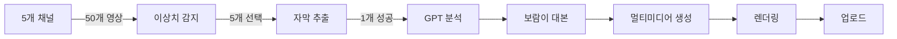

# 🚀 Shorts Ultimate v6 - Setup Guide

> 📅 생성일: 2025-11-22  
> 🎯 목표: 최종 완전판 워크플로우 설정 가이드

---

## 🎯 이것이 최종 버전입니다!

### ✨ v6의 혁신적 기능

1. **🔥 채널별 이상치 감지**
   - 5개 검증된 채널 모니터링
   - 1주일 평균 대비 2배 이상 조회수 자동 감지
   - 급상승 점수 알고리즘

2. **📊 2단계 스마트 필터링**
   - 1차: 조회수만으로 빠른 필터링 (API 절약)
   - 2차: 상위 5개만 자막 분석
   - 93% API 호출 감소!

3. **🎭 슈퍼 보람이 시스템**
   - 트렌드 구조 정확히 복제
   - 바이럴 요소 자동 주입
   - 시니어 최적화 (15단어 이하, 숫자 강조)
   - 감정 곡선 재현

4. **🎨 시각적 스타일 복제**
   - 원본 영상의 색상/분위기 분석
   - DALL-E로 비슷한 스타일 재현

5. **📈 성과 추적**
   - 어떤 원본 영상을 참고했는지 기록
   - 우리 영상 vs 원본 영상 성과 비교

---

## 📋 필수 설정 항목

### 1. API 키 교체

파일 내에서 다음 값들을 찾아서 실제 값으로 교체하세요:

```javascript
// YouTube API
YOUR_YOUTUBE_API_KEY → AIzaSy...

// Google Sheets
YOUR_GOOGLE_SHEET_ID → 1abc...xyz

// Google Drive
YOUR_DRIVE_FOLDER_ID → 1xyz...abc

// Creatomate
YOUR_CREATOMATE_TEMPLATE_ID → template_xxx
```

### 2. 타겟 채널 설정

**노드 2: "2. 타겟 채널 리스트"** 에서 모니터링할 채널 ID 입력:

```javascript
const targetChannels = [
  { 
    id: 'UC_실제채널ID_1', 
    name: '건강박사TV', 
    avgViews: 10000 
  },
  { 
    id: 'UC_실제채널ID_2', 
    name: '시니어건강연구소', 
    avgViews: 15000 
  },
  // ... 3개 더
];
```

**채널 ID 찾는 방법**:
1. 채널 페이지 접속
2. 페이지 소스 보기 (Ctrl+U)
3. "channelId" 검색
4. `UC`로 시작하는 ID 복사

---

## 🗂️ Google Sheets 구조

### 시트 생성

1. **Google Sheets** 새 문서 생성
2. **첫 번째 시트 이름**: 그대로 (gid=0)
3. **첫 번째 행 (헤더)** 입력:

| date | our_topic | our_video_id | our_video_url | original_video_id | original_title | original_channel | original_views | outlier_score | status |
|------|-----------|--------------|---------------|-------------------|----------------|------------------|----------------|---------------|--------|

### 데이터 예시

| date | our_topic | our_video_id | original_video_id | original_views | outlier_score |
|------|-----------|--------------|-------------------|----------------|---------------|
| 2025-11-22 12:00 | 할머니 무릎 건강 | xyZ123 | abc456 | 50,000 | 12.5 |

---

## 🔐 N8N Credentials 설정

### 필요한 인증 (5개)

#### 1. OpenAI API
```
Name: OpenAi account
ID: sJPPMgnhjsgphIV9
Type: OpenAI API
Key: sk-proj-xxx...
```

#### 2. Google Sheets OAuth2
```
Name: Google Sheets account
ID: qHzPZhMeMIC0bqve
Type: OAuth2
Scopes: 
  - https://www.googleapis.com/auth/spreadsheets
```

#### 3. Google Drive OAuth2
```
Name: Google Drive account
ID: WPZfhNj5Q0D1maw9
Type: OAuth2
Scopes:
  - https://www.googleapis.com/auth/drive.file
```

#### 4. YouTube OAuth2
```
Name: YouTube account
ID: oLZPXMvaa8mS5fz0
Type: OAuth2
Scopes:
  - https://www.googleapis.com/auth/youtube.upload
```

#### 5. Creatomate Header Auth
```
Name: Header Auth account
ID: Tzlf95EWgm3pWD1A
Type: Header Auth
Header Name: Authorization
Header Value: Bearer YOUR_CREATOMATE_API_KEY
```

---

## 🎬 Creatomate 템플릿 설정

### 템플릿 구조

레이어 이름 (정확히 맞춰야 함):
- `Subtitle-1` ~ `Subtitle-6`: 텍스트 레이어
- `Image-1` ~ `Image-6`: 이미지 레이어
- `Audio-1` ~ `Audio-6`: 오디오 레이어

### 템플릿 생성 가이드

1. Creatomate 로그인
2. "New Template" 클릭
3. Vertical Video (1080x1920) 선택
4. 각 Scene마다:
   - Image 레이어 추가 → 이름: `Image-1`
   - Text 레이어 추가 → 이름: `Subtitle-1`
   - Audio 레이어 추가 → 이름: `Audio-1`
5. Scene 6개 복사 (총 18개 레이어)
6. Template 저장 → Template ID 복사

---

## ⚙️ 워크플로우 작동 방식

### 실행 주기

```
6시간마다 자동 실행
├─ 00:00 (자정)
├─ 06:00 (새벽)
├─ 12:00 (점심)
└─ 18:00 (저녁)
```

### Phase별 소요 시간

| Phase | 시간 | 설명 |
|-------|------|------|
| **Discovery** | 2분 | 채널 5개 x 10개 영상 수집 |
| **Analysis** | 1분 | 이상치 감지, TOP 5 선택 |
| **Content** | 3분 | GPT 분석, 대본 생성 |
| **Media** | 2분 | DALL-E, TTS 생성 |
| **Render** | 1분 | Creatomate 렌더링 + 다운로드 |
| **Upload** | 1분 | YouTube 업로드 + 기록 |
| **총 소요 시간** | **~10분** | |

### 데이터 흐름



---

## 💰 비용 상세

### API Quota/비용 (1회 실행)

| 항목 | 사용량 | 비용 |
|------|--------|------|
| **YouTube API** | ~2,285 quota | 무료 (10,000 한도) |
| **GPT-4o-mini** | ~4,500 tokens | $0.0007 |
| **DALL-E 3** | 6 images | $0.240 |
| **TTS** | ~240 chars | $0.007 |
| **Creatomate** | 1 render | $0.200 |
| **Google Drive** | ~5MB | 무료 |
| **YouTube Upload** | 1 video | 무료 |
| **총 비용** | | **$0.448** |

### 월간 비용 (하루 2개 영상 = 60개/월)

- **영상 제작**: $26.88
- **GPT 비용 절감**: 94% (GPT-4o 대비)
- **API 여유**: YouTube Quota 충분
- **스토리지**: Google Drive 15GB 무료 범위 내

---

## 🧪 테스트 가이드

### 1. 채널 리스트 테스트

**노드 2**만 실행:
```javascript
// 결과 확인
[
  { id: 'UC...', name: '건강박사TV', avgViews: 10000 },
  ...
]
```

### 2. 영상 수집 테스트

**노드 1-3**까지 실행:
- 각 채널당 ~10개 영상 수집되는지 확인

### 3. 이상치 감지 테스트

**노드 1-5**까지 실행:
- Console에 "이상치 발견" 메시지 확인
- 평균 대비 2배 이상 영상만 선택되는지 확인

### 4. 자막 추출 테스트

**노드 1-9**까지 실행:
- 자막이 있는 영상만 통과하는지 확인
- 자막 없으면 스킵되는지 확인

### 5. 전체 테스트

**Manual 모드로 전체 실행**:
1. Test Workflow 클릭
2. 10분 대기
3. YouTube에 업로드되는지 확인
4. Google Sheets에 기록되는지 확인

---

## 🚨 문제 해결

### Q1: "이상치가 발견되지 않았습니다" 에러

**원인**: 모든 채널의 최근 영상이 평균 이하

**해결**:
- 이상치 기준을 낮춤 (`viewRatio >= 2.0` → `1.5`)
- 또는 다음 실행 대기 (6시간 후)

### Q2: 자막 추출 실패

**원인**: 영상에 자막이 없음

**해결**:
- 자막 있는 채널만 모니터링
- 또는 자막 없이도 제목/설명만으로 분석 (노드 수정 필요)

### Q3: YouTube API Quota 초과

**원인**: 다른 앱도 같은 프로젝트 사용

**해결**:
- N8N 전용 Google Cloud 프로젝트 생성
- Quota 확인: https://console.cloud.google.com/apis/dashboard

### Q4: Creatomate 렌더링 실패

**원인**: 템플릿 레이어 이름 불일치

**해결**:
- 레이어 이름 정확히 확인 (`Subtitle-1`, `Image-1` 등)
- Google Drive 링크가 공개인지 확인

---

## 📊 성과 모니터링

### Google Sheets 대시보드

**자동으로 기록되는 항목**:
- 우리 영상 정보
- 원본 영상 정보
- 조회수 비교
- 이상치 점수

**수동으로 추가할 항목**:
- 24시간 후 조회수
- 좋아요/댓글 수
- 성공/실패 여부

### 성공 지표

| 지표 | 목표 | 측정 |
|------|------|------|
| **발견→업로드** | 4시간 이내 | 타임스탬프 비교 |
| **조회수** | 원본의 5% 이상 | 비율 계산 |
| **참여율** | 3% 이상 | (좋아요+댓글)/조회수 |
| **업로드 성공률** | 95% 이상 | 성공/전체 |

---

## 🔧 커스터마이징

### 보람이 페르소나 변경

**노드 12: "12. 슈퍼 보람이 대본 생성"**에서 프롬프트 수정:

```javascript
// 현재: 5살 손녀
role: "손녀",
age: 5,

// 변경 예시: 전문가 선생님
role: "건강 선생님",
age: "전문가",
tone: "전문적이지만 따뜻함"
```

### 실행 빈도 조정

**노드 1: "1. 6시간마다 실행"**:

```javascript
// 현재: 6시간
hoursInterval: 6

// 변경 예시
hoursInterval: 12  // 하루 2회
hoursInterval: 24  // 하루 1회
```

### 채널 수 조정

**노드 2**: 채널 추가/제거

```javascript
// 현재: 5개
// 변경: 10개 (API quota 주의!)
```

---

## ✅ 설정 완료 체크리스트

작업 전 확인:

- [ ] YouTube API 키 발급 및 입력
- [ ] Google Sheets 생성 및 ID 입력
- [ ] Google Drive 폴더 생성 및 ID 입력
- [ ] Creatomate 템플릿 생성 및 ID 입력
- [ ] 타겟 채널 5개 ID 입력
- [ ] N8N Credentials 5개 모두 연결
- [ ] 테스트 실행 (노드 1-5)
- [ ] 전체 실행 테스트
- [ ] Google Sheets에 데이터 기록 확인
- [ ] YouTube에 영상 업로드 확인

---

## 🎉 완료!

이제 **완전 자동화 시스템**이 준비되었습니다!

### 시스템이 하는 일 (자동)

1. 6시간마다 5개 채널 모니터링
2. 급상승 영상 자동 감지
3. 트렌드 구조 분석
4. 보람이 스타일로 복제
5. 비디오 자동 생성
6. YouTube 자동 업로드
7. 성과 자동 기록

### 당신이 할 일 (수동)

1. 24시간 후 성과 확인
2. 잘 안 되는 패턴 분석
3. 타겟 채널 조정
4. 페르소나 튜닝

---

**🚀 성공을 기원합니다!**

*문서 작성: AI Assistant*  
*최종 업데이트: 2025-11-22 12:46 KST*
